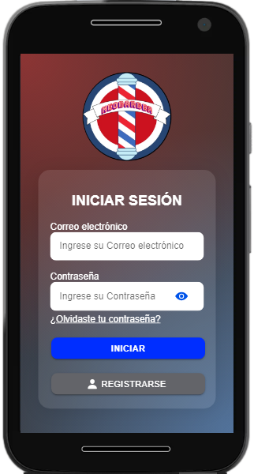

# 📱 NeoBarber

Aplicación móvil para gestión de citas en barberías. NeoBarber permite a los usuarios agendar citas, elegir servicios y gestionar sus perfiles de manera eficiente. Con una interfaz intuitiva y fácil de usar, NeoBarber está diseñada para mejorar la experiencia tanto de los clientes como de los barberos.

<!--  -->

## ✨ Roles y Características
- Perfil personalizado
<!-- - Notificaciones en tiempo real -->
<!-- - Offline-first para funciones no inmediatas -->
### Administrador
- Agregar usuarios de roles inferiores
- Gestionar los servicios a brindar
- Gestionar atenciones
- Historial general
### Barbero
- Gestionar atenciones
- Gestionar Horario
- Historial de atenciones
### Cliente
- Reserva de citas en horario especifico
- Historial de citas

<!-- ## 🚀 Instalación -->

<!-- ### Requisitos -->
<!-- - Android 6.0 o superior
- 25MB de espacio libre -->
<!-- - Conexión a internet -->

<!-- ### Pasos
1. Descarga el APK
2. Permite instalación de orígenes desconocidos
3. Instala la aplicación
4. Regístrate o inicia sesión -->

## 🛠️ Tecnologías

- Angular/Ionic 
- MySQL
- PHP/Laravel
<!-- - Firebase -->

<!-- ## 📷 Ilustraciones del aplicativo -->

<!-- <table> -->
 <!-- <tr> -->
   <!-- <td></td> -->
   <!-- <td></td> -->
   <!-- <td></td> -->
 <!-- </tr> -->
<!-- </table> -->
